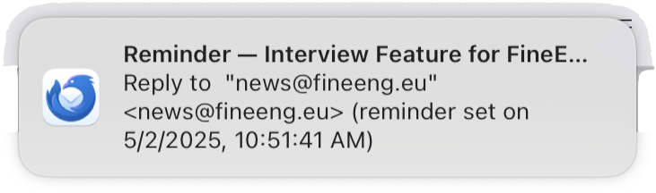

# Snooze emails in Thunderbird

Dead simple. Click 'Set reminder', enter the delay, for example `5d` for five days from now.

You will receive a notification.

Clicking the notification opens the email.
